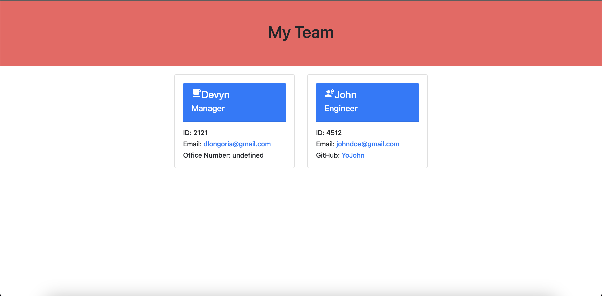

# TEAM PROFILE GENERATOR

## Table of Contents:

1. [Description](#Description)
2. [Built-With](#Built-With)
3. [Screenshot](#Screenshot)
4. [Demo](#Demo)
5. [Contact-Me](#Contact-Me)

## Description
Team Profile Generator is a great tool for a manager to create a webpage that display's their team's basic info so that they can have easy access to employees emails and github profiles. 

## Built-With
* Node.js
* JavaScript
* Inquirer npm
* HTML
* CSS
* Jest

## Screenshot

## Demo
[Demo](https://drive.google.com/file/d/1RKDvJHKv-A0ghx-P-AtxcQvlHjw0mKjz/view?usp=share_link)

## Contact-Me

    
Contact

    devynlongoria99@gmail.com  

